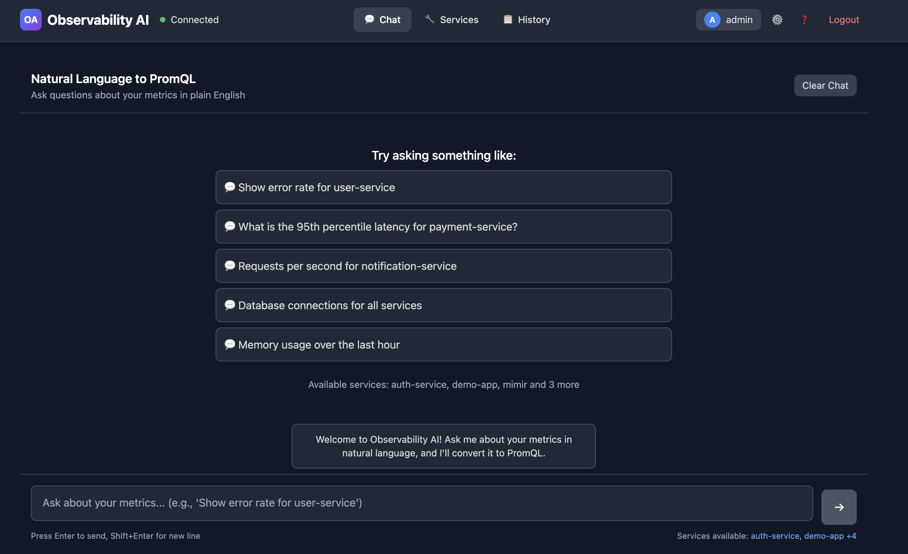
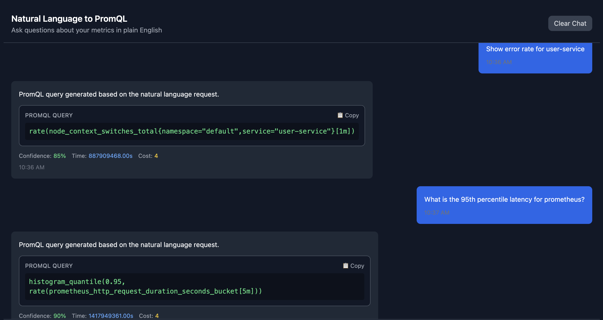
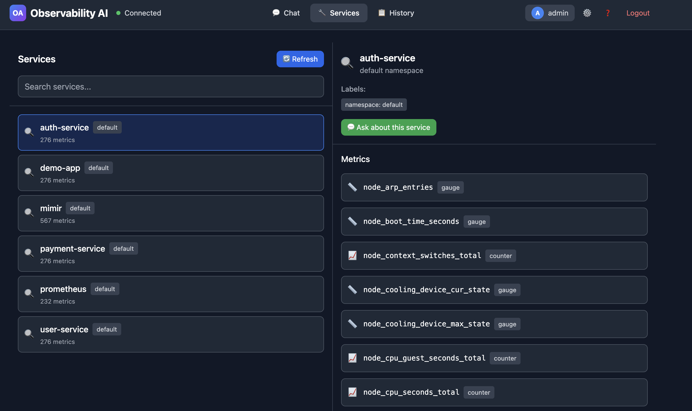
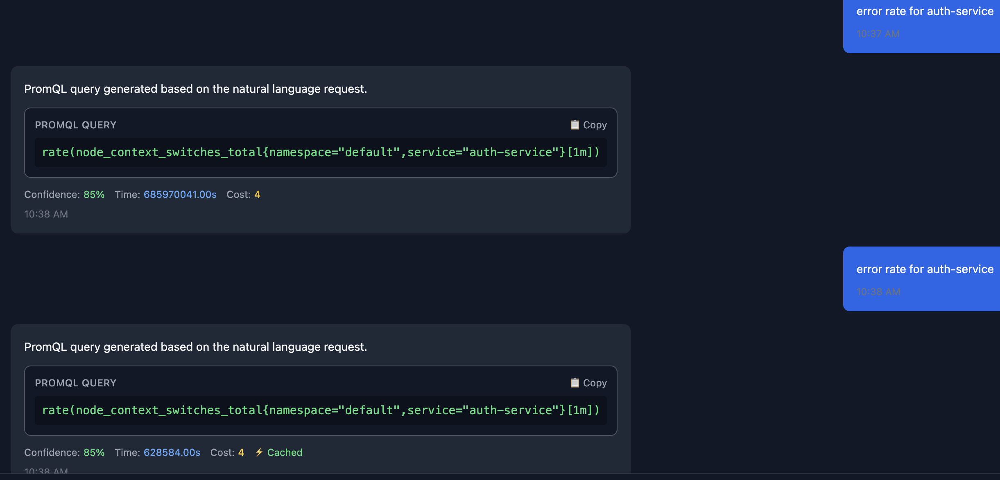
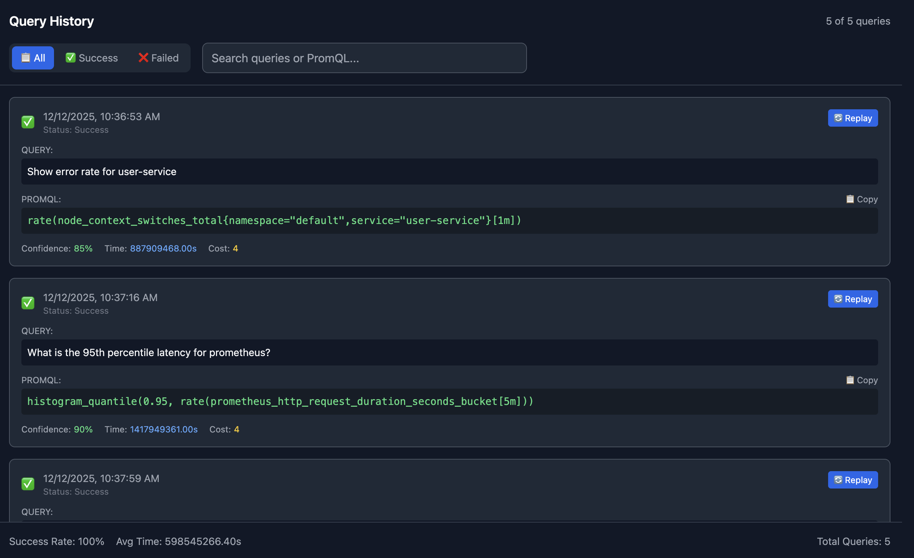

## The Observability Barrier

Picture this: It's 2 AM, your service is experiencing elevated latency, and you need to check CPU usage for your authentication service. You know exactly what you need to find out, but there's a problem. You're staring at a blank Prometheus query editor, trying to remember the exact syntax for rate functions, wondering if the label is `service`, `job`, or `app`, and debating whether you need `container_cpu_usage_seconds_total` or `process_cpu_seconds_total`.

Fifteen minutes later, after consulting documentation, copying examples from old dashboards, and several trial-and-error attempts, you finally have your query: `rate(container_cpu_usage_seconds_total{service="auth"}[5m])`.

This scenario plays out thousands of times a day across engineering teams worldwide. **PromQL is powerful, but its steep learning curve creates an invisible barrier between developers and their observability data.**

## The Real Cost of Complexity

The challenge with PromQL isn't just about syntax. It's about access to information. When only senior engineers and SREs can efficiently query metrics, observability becomes siloed. Junior developers wait for help instead of investigating issues themselves. Product engineers rely on pre-built dashboards that may not answer their specific questions. Site reliability work becomes bottlenecked by the handful of people who've mastered the existing tools.

According to our analysis of common observability tasks, engineers spend an average of 8-12 minutes crafting PromQL queries that should take seconds to conceptualize. That's not just lost productivity, it's lost learning opportunities and slower incident response.

**What if asking questions about your systems was as natural as, well, asking questions?**

## Enter Observability AI

I built [Observability AI](https://github.com/seanankenbruck/observability-ai) to solve exactly this problem. It's an open-source natural language interface for Prometheus and Mimir that translates plain English questions into accurate, safe PromQL queries in seconds.

<figure>
  
  <figcaption>Home page of the Observabilty AI application</figcaption>
</figure>

Instead of memorizing syntax, you simply ask:

> "What's the CPU usage for the auth service?"

The system understands your intent, discovers the relevant metrics in your infrastructure, generates the correct PromQL query, validates it for safety, and returns both the query and a confidence score for the accuracy of its translation, all within 2 seconds.

<figure>
  
  <figcaption>Example PromQL responses to questions</figcaption>
</figure>

Take the generated query, copy it into your chosen Prometheus/Mimir querying tool and voila, you have the data you were looking for.


### From Minutes to Seconds

Let's look at real-world time savings:

| What You Ask | Traditional PromQL Time | Observability AI Time | Query Generated |
|--------------|------------------------|----------------------|-----------------|
| "Show me error rate for the payment service" | ~5 minutes | 2 seconds | `sum(rate(http_requests_total{service="payment",status=~"5.."}[5m]))` |
| "Memory usage across all pods in production" | ~3 minutes | 2 seconds | `sum(container_memory_usage_bytes{namespace="production"}) by (pod)` |
| "Compare API latency: auth vs checkout" | ~10 minutes | 2 seconds | `histogram_quantile(0.95, sum(rate(http_request_duration_seconds_bucket{service=~"auth\|checkout"}[5m])) by (service,le))` |
| "What's breaking right now?" | ~15 minutes | 2 seconds | (Intelligently queries error metrics and recent spikes) |

The third example is particularly illuminating. Writing a histogram quantile query that compares P95 latency across multiple services requires deep PromQL knowledge. With Observability AI, it's a simple question.

## How It Works: Architecture That Scales

The system is built on a sophisticated multi-layer architecture that balances AI intelligence with safety and performance.

```
┌─────────────┐      ┌──────────────┐      ┌─────────────┐      ┌────────────────┐
│   You Ask   │ ───▶ │ Observability│ ───▶ │  Claude AI  │ ───▶ │   Prometheus   │
│  Question   │      │      AI      │      │  (PromQL)   │      │     /Mimir     │
└─────────────┘      └──────────────┘      └─────────────┘      └────────────────┘
                            │                     │                      │
                            │                     ▼                      │
                            │              ┌─────────────┐               │
                            │              │  Validate   │               │
                            │              │   & Cache   │               │
                            │              └─────────────┘               │
                            │                                            │
                            ◀────────────── Results ─────────────────────┘
```

**The Flow:**

1. **Ask** - You submit a natural language query via API or UI
2. **Understand** - AI analyzes your question with semantic context from your metrics
3. **Generate** - Claude creates accurate, safe PromQL
4. **Validate** - Query is checked for safety and validated against your actual services

### The Processing Pipeline

**1. Natural Language Understanding**

When you submit a query, the system first classifies your intent using pattern matching and semantic analysis. Are you asking about errors? Performance metrics? Resource utilization? This classification helps guide the AI toward the right metric types.

```
User Input: "What is the CPU usage for the auth service?"
↓
Intent Classification: {
  type: "resource_metrics",
  resource: "cpu",
  service: "auth",
  aggregation: "current_value"
}
```

**2. Semantic Metric Discovery**

Here's where it gets interesting. The system doesn't rely on hardcoded metric mappings. Instead, it automatically discovers services and metrics from your Prometheus or Mimir instance. It catalogs:

- All available services (extracted from metric labels like `service`, `job`, or `app`)
- Their associated metrics (categorized by type: counters, gauges, histograms)
- Label patterns and cardinality
- Metric relationships and common usage patterns

This catalog is stored in PostgreSQL with pgvector for semantic similarity matching. When you ask about "CPU usage," the system finds similar past queries and relevant metrics using vector embeddings. Here is a screenshot of the _Services_ screen in the UI. 

<figure>
  
  <figcaption>Services discovered by Observability AI</figcaption>
</figure>

You can see all existing services and generate questions directly from this screen.

**3. AI-Powered Query Generation**

The system sends a carefully constructed prompt to Claude AI (Anthropic's language model) that includes:

- **Strict rules** about only using discovered metrics
- **Your available metrics catalog** organized by service and type
- **Metric type guidance** (e.g., use `rate()` for counters, `histogram_quantile()` for histograms)
- **Similar past queries** as examples
- **Your specific question** with extracted context

The AI generates a PromQL query following these constraints. Critically, if no suitable metrics exist, it returns an error message rather than hallucinating a query.

**4. Safety Validation**

Before executing any query, the system validates it through multiple safety checks:

- **Forbidden patterns**: Blocks queries that could delete data or access sensitive metrics
- **Time range limits**: Prevents excessively large time ranges that could overwhelm Prometheus
- **Cardinality checks**: Detects high-cardinality operations that could cause performance issues
- **Complexity limits**: Restricts deeply nested queries that might be inefficient

Only queries that pass all safety checks are executed.

**5. Intelligent Caching**

Results are cached in Redis with a 5-minute TTL. If you or a teammate asks the same question, you get instant results. This dramatically reduces load on both the AI service and your metrics backend.

<figure>
  
  <figcaption>Example cached query</figcaption>
</figure>

The query is returned from the cache instead of from calling the Claude API. 

### The Technology Stack

The architecture leverages modern, production-ready technologies:

**Backend (Go)**
- **Gin** for high-performance HTTP routing
- **PostgreSQL with pgvector** for semantic search and metric storage
- **Redis** for caching and session management
- **Claude AI** for natural language understanding and query generation

**Frontend (React + TypeScript)**
- **Vite** for fast development and optimized builds
- **Tailwind CSS** for responsive UI design
- **Type-safe API client** for reliable backend communication

**Infrastructure**
- **Docker Compose** for local development and simple deployments
- **Kubernetes Helm charts** for production-grade orchestration
- **Automated discovery service** that syncs with Prometheus/Mimir every 5 minutes


## Enterprise-Ready Features

What makes this more than a proof-of-concept is its production-ready feature set:

### Authentication & Authorization

- **JWT-based authentication** with role-based access control (RBAC)
- **API key management** for programmatic access and service accounts
- **Per-user and per-key rate limiting** to prevent abuse
- **Session management** with configurable expiration

### Observability of Observability

The system instruments itself with comprehensive metrics:

- Query processing times and success rates
- AI token usage and costs
- Cache hit rates
- Safety validation violations
- Service health checks for all dependencies

You can monitor your observability platform with the same ease you monitor your applications.

### Automatic Service Discovery

Perhaps the most powerful feature is automatic discovery. Point the system at your Prometheus or Mimir endpoint, and it:

1. Queries for all available time series metadata
2. Extracts service names from common label patterns
3. Catalogs metrics and their label sets
4. Stores relationships in the semantic database
5. Updates embeddings for improved query matching
6. Repeats at configurable intervals (default: 5 minutes)

This means zero manual configuration. As you deploy new services and they start emitting metrics, Observability AI automatically learns about them and can answer questions within minutes.

### Query History

The UI also provides insights into your query history providing both successful and failed queries. You can even _Replay_ queries directly from the history screen. 

<figure>
  
  <figcaption>Example cached query</figcaption>
</figure>

## Democratizing Observability

The real impact of this approach isn't just time savings, it's about changing who can participate in observability.

**Junior Developers** can investigate issues without waiting for senior help. They ask questions in their own words and get accurate results, learning PromQL patterns along the way by seeing the generated queries.

**Product Engineers** can validate feature performance without creating Jira tickets for SRE. They can explore metrics interactively, asking follow-up questions and diving deeper into the data.

**Data Scientists** can analyze system behavior without learning yet another query language. They can focus on insights rather than syntax.

**Site Reliability Engineers** spend less time teaching PromQL and more time on higher-level problems. They can still write complex queries manually when needed, but routine questions are self-service.

This is what democratization looks like: **removing the knowledge barrier between people and their data.**

## Real-World Example: Debugging a Production Issue

Let's walk through a realistic scenario. Your checkout service is experiencing intermittent errors. Here's how an investigation might unfold:

**Query 1**: "Show me error rate for the checkout service"
```promql
sum(rate(http_requests_total{service="checkout",status=~"5.."}[5m]))
```
*Result: 12% error rate (elevated from baseline of 0.5%)*

**Query 2**: "What's the latency for checkout?"
```promql
histogram_quantile(0.95, sum(rate(http_request_duration_seconds_bucket{service="checkout"}[5m])) by (le))
```
*Result: P95 latency is 2.3s (normal is 300ms)*

**Query 3**: "Memory usage for checkout pods"
```promql
sum(container_memory_usage_bytes{service="checkout"}) by (pod)
```
*Result: One pod is using 3.8GB (others are using 1.2GB)*

**Query 4**: "Database connection pool size for checkout"
```promql
max(database_connections_active{service="checkout"}) by (pod)
```
*Result: The high-memory pod has 500 active connections (max pool size)*

In under two minutes, asking natural questions, you've identified a connection leak in one pod. No PromQL documentation required.

## Safety First: What Could Go Wrong?

When you give AI the ability to generate queries against production systems, safety is paramount. The system implements defense-in-depth:

**Read-Only Operations**
Only query operations are supported. No write, delete, or configuration changes are possible.

**Metric Allowlisting**
The AI can only use metrics that exist in the discovered catalog. It cannot query arbitrary metrics or guess metric names.

**Query Validation**
Every generated query passes through safety checks before execution:
- Time range validation (prevents queries spanning months/years)
- Cardinality limits (prevents high-cardinality explosions)
- Complexity limits (prevents deeply nested aggregations)
- Pattern blocklists (prevents known dangerous patterns)

**Rate Limiting**
Per-user and per-API-key rate limits prevent accidental or malicious system overload.

**Audit Logging**
All queries are logged with user context for security auditing and compliance.

**Cost Controls**
AI token usage is tracked and can be budgeted to prevent unexpected costs.

## Getting Started in 5 Minutes

The quickest path to trying this yourself:

```bash
# Clone the repository
git clone https://github.com/seanankenbruck/observability-ai.git
cd observability-ai

# Configure your environment
cp .env.example .env
# Edit .env to add your Claude API key and Prometheus/Mimir endpoint

# Start everything with Docker
make start-dev-docker

# Open the web UI
open http://localhost:3000
```

The system includes a complete development environment with PostgreSQL, Redis, and a demo setup. Point it at your Prometheus instance, and you're querying in natural language within minutes.

For production deployments, Kubernetes Helm charts are provided with configurable security, scaling, and monitoring options. Check out the latest [Production Release](https://github.com/seanankenbruck/observability-ai/releases) 🎉! 

## What's Next: The Roadmap

This is an evolving project with an ambitious roadmap:

**Short-term improvements:**

- Multi-turn conversations (ask follow-up questions with context)
- Query explanation mode (explain what a PromQL query does in plain English)
- Suggested related queries based on current results
- Export to dashboard/alert configuration

**Medium-term features:**

- Support for additional backends (VictoriaMetrics, Thanos, Cortex)
- Anomaly detection ("show me unusual patterns in service X")
- Natural language alerting ("notify me if checkout errors exceed 5%")
- Query optimization suggestions

**Long-term vision:**

- Root cause analysis assistance
- Automated runbook generation
- Integration with incident management platforms
- Multi-datasource correlation (logs + metrics + traces)

**This is where open source shines.** The project is MIT licensed and actively seeking contributors. Whether you're interested in improving the AI prompts, adding new backends, building better UIs, or enhancing safety checks, there's room for contribution.

## Try It, Break It, Improve It

Observability AI is open source because observability should be accessible to everyone. The code is on [GitHub](https://github.com/seanankenbruck/observability-ai), the documentation is comprehensive, and the community is just getting started.

**Here's what I'm asking:**

1. **Star the repository** if this solves a problem you've experienced
2. **Try it in your environment** and share your experience
3. **Open issues** for bugs, feature requests, or documentation improvements
4. **Contribute** if you have ideas for making it better
5. **Share** with teams who struggle with observability access

The barrier between developers and their observability data is artificial. It's a side effect of tool design, not a fundamental requirement. With AI-powered natural language interfaces, we can tear down that barrier and make observability truly universal.

**Stop writing PromQL. Start asking questions.**

---

## Additional Resources

- **GitHub Repository**: [seanankenbruck/observability-ai](https://github.com/seanankenbruck/observability-ai)
- **Documentation**: Comprehensive guides in the `/docs` folder
- **Quick Start Guide**: Get running in under 5 minutes
- **Deployment Guide**: Production-ready Kubernetes deployment
- **API Reference**: Full REST API documentation for integration


---

<div class="post-navigation">
  <a href="/posts/development-on-raspberry-pi" class="nav-article prev">
    <span class="nav-label">Previous Article</span>
    <span class="nav-title">Development on Raspberry Pi</span>
  </a>
</div>
