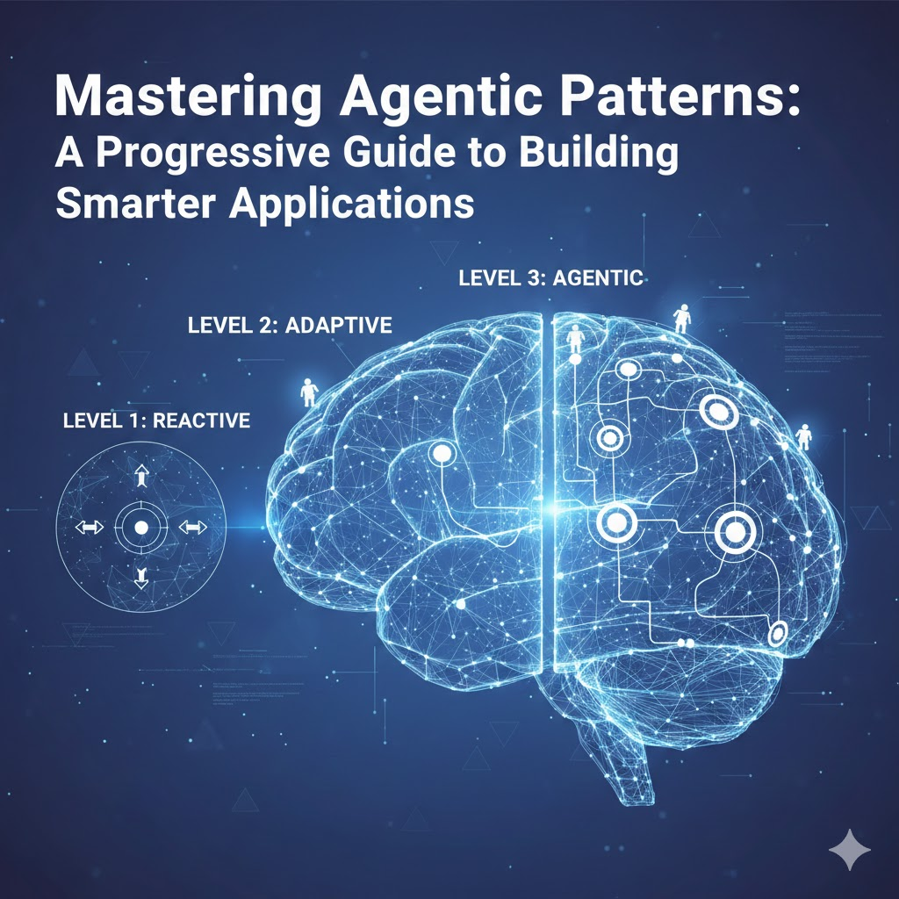

<figure>
  
</figure>

## What Lies Beyond Simple Prompting

If you've been working with Large Language Models (LLMs) like Claude or ChatGPT, you've probably experienced that "aha!" moment when you realize these models can do far more than just answer questions. They can become active participants in complex workflows, reasoning through problems, coordinating tasks, and even collaborating with other AI agents to solve challenges that would be difficult with traditional programming approaches.

But here's the catch: unlocking this potential requires more than just writing clever prompts. You need to understand **agentic patterns** and how to use them. These patterns are architectural approaches that transform LLMs from simple question answering systems into powerful, autonomous agents that can tackle real-world software engineering challenges.

That's exactly what this blog post is about: providing you with production-ready, easy-to-understand implementations of the most important agentic patterns (in my opinion), complete with complete examples that you can learn from and adapt to your own projects.

## Why Agentic Patterns Matter

Before we dive into the patterns themselves, let's talk about why they matter. Traditional programming is deterministic: you write explicit instructions, and the computer follows them precisely. LLMs, on the other hand, are probabilistic reasoning engines. They excel at understanding context, making judgments, and generating creative solutions. However, they need structure to do this effectively.

Agentic patterns provide that structure. They're like architectural blueprints that show you how to:
- Break down complex problems into manageable steps
- Coordinate multiple AI operations efficiently
- Build feedback loops that improve output quality
- Enable AI agents to reason and make decisions autonomously
- Orchestrate multiple specialized agents working together

The patterns in this repository progress from simple to complex, allowing you to build your understanding incrementally. Let's walk through them together.

## Pattern 1: Prompt Chaining - Sequential Steps

**Complexity Level:** Low-Medium  
**Best For:** Multi-stage transformations, analysis pipelines  

Imagine you're building a code review system. You could throw all your requirements into one massive prompt and hope for the best, or you could break it down into logical steps where each stage builds on the previous one. That's prompt chaining in a nutshell.

### How It Works

Prompt chaining sequences multiple LLM calls where each step's output becomes the input for the next. Think of it like an assembly line: each station does one specific job well, and the product improves as it moves through the line.

The implementation in this repository demonstrates a complete code review pipeline with five stages:

```typescript
async runPipeline(code: string, fileName: string): Promise<PipelineResult> {
  // Step 1: Analyze code for issues
  const analysis = await this.analyzeCode(code, fileName);

  // Step 2: Gate check - if code is clean, exit early
  if (analysis.overallStatus === 'good') {
    return {
      shouldUpdate: false,
      message: 'Code looks good!'
    };
  }

  // Step 3: Propose solutions for identified issues
  const solutions = await this.proposeSolutions(analysis, code);

  // Step 4: Generate updated code implementing solutions
  const updatedCode = await this.generateUpdatedCode(code, solutions);

  // Step 5: Create commit message summarizing changes
  const commitMessage = await this.generateCommitMessage(analysis, solutions);

  return {
    shouldUpdate: true,
    updatedCode,
    commitMessage,
    analysis
  };
}
```

### The Power of Gates

Notice the gate mechanism at step 2? If the code analysis finds no issues, the pipeline exits early rather than wasting API calls on unnecessary steps. This is a key efficiency pattern you'll use throughout agentic development, always check if you actually need to proceed before making expensive LLM calls.

### When to Use Prompt Chaining

- Document processing workflows (extract → summarize → categorize)
- Content creation pipelines (research → outline → draft → edit)
- Data transformation sequences (parse → validate → enrich → format)
- Any task where intermediate results need inspection or transformation

**Key Takeaway:** Prompt chaining teaches you to think in terms of atomic, composable steps. Each step should have a clear input and output, making your workflow easy to debug and modify.

## Pattern 2: Parallelization - Speed Through Concurrency

**Complexity Level:** Medium  
**Best For:** Batch processing, multi-faceted analysis, large document handling  

Once you've mastered sequential workflows, the next question is: "What if some of these steps don't depend on each other? Can we run them simultaneously?"

Absolutely. That's parallelization.

### Two Complementary Approaches

This repository demonstrates two distinct parallelization strategies, each solving different problems:

#### Approach 1: Sectioning for Scalability

When you need to process a 50-page document, you don't want to send the entire thing to an LLM in one call (hello, context limits and latency issues). Instead, split it into logical sections and process them simultaneously:

```typescript
async summarizeDocument(document: string): Promise<SummaryResult> {
  // Split document into sections based on word count
  const sections = this.splitIntoSections(document);

  // Process ALL sections in parallel
  const sectionSummaries = await Promise.all(
    sections.map((section, index) =>
      this.summarizeSection(section, index, sections.length)
    )
  );

  // Aggregate section summaries into final summary
  const finalSummary = await this.aggregateSummaries(
    sectionSummaries,
    document
  );

  return {
    summary: finalSummary,
    compressionRatio: document.split(' ').length /
                     finalSummary.split(' ').length
  };
}
```

The beauty of this implementation is the use of `Promise.all()` a common pattern to handle multiple async operations concurrently, dramatically reducing total processing time. A 10-section document that would take 50 seconds sequentially might complete in 8-10 seconds with parallel processing.

#### Approach 2: Voting for Quality

What if instead of processing different parts of your input, you want to generate multiple complete solutions and pick the best one? That's the voting approach:

```typescript
async generateBestSummary(document: string): Promise<VotingResult> {
  // Generate multiple summary candidates with different approaches
  const candidates = await Promise.all([
    this.generateTechnicalSummary(document),
    this.generateExecutiveSummary(document),
    this.generateDetailedSummary(document),
    this.generateConciseSummary(document)
  ]);

  // Use an LLM evaluator to select the best summary
  const selection = await this.selectBestSummary(candidates, document);

  return {
    selectedSummary: selection.winner,
    reasoning: selection.reasoning,
    alternatives: candidates
  };
}
```

Each candidate is generated in parallel with different instructions (technical focus vs. executive summary vs. detailed analysis), then an evaluator LLM judges which one best meets your quality criteria. This is essentially an ensemble approach, leveraging multiple perspectives to maximize quality.

### When to Use Parallelization

- Large document summarization (sectioning)
- Batch data processing (multiple independent items)
- Quality optimization (voting/ensemble approaches)
- Multi-perspective analysis (legal + technical + business views)

**Key Takeaway:** Parallelization isn't just about speed, it is also about quality. The voting pattern shows how generating multiple options and selecting the best can yield better results than a single attempt.

## Pattern 3: Routing - The Right Tool for the Right Job

**Complexity Level:** Medium-High  
**Best For:** Multi-capability systems, customer support, query classification  

Not every task requires the same approach. Some questions need a web search, others need database queries, and some require deep reasoning. Routing intelligently directs each request to the appropriate handler based on classification.

### How Intelligent Routing Works

The routing pattern has three key components:

1. **Classifier:** Analyzes the input and determines intent
2. **Router:** Validates classification and selects handler
3. **Handlers:** Specialized processors for each intent type

```typescript
async route(userQuery: string): Promise<RouterResponse> {
  // Step 1: Classify the user's intent
  const classification = await this.classifier.classify(userQuery);

  // Step 2: Safety and confidence checks
  if (classification.safetyFlags.critical.length > 0) {
    return {
      success: false,
      message: 'Query blocked due to safety concerns',
      safetyFlags: classification.safetyFlags
    };
  }

  if (classification.confidence < 60) {
    return {
      success: false,
      message: 'Please clarify your request',
      suggestedIntents: classification.alternativeIntents
    };
  }

  // Step 3: Route to appropriate handler
  const handler = this.getHandler(classification.intent);
  return await handler.handle(userQuery, classification);
}
```

### Multi-Layered Safety

Notice the safety checks? The routing pattern includes comprehensive validation:

- **SQL injection detection** for data queries
- **PII identification** to warn about sensitive data
- **Bulk operation flags** for potentially expensive requests
- **Confidence thresholds** to prevent misrouting

This makes routing particularly valuable for user-facing applications where safety and accuracy are paramount.

### Supported Intent Types

The repository demonstrates five common intent types:

- **Data Lookup:** Internal database queries with SQL injection protection
- **Calculation:** Math operations and unit conversions
- **Web Search:** External information retrieval
- **Reasoning:** Analysis, recommendations, decision support
- **General:** Fallback for conversational queries

### When to Use Routing

- Customer support systems with multiple capabilities
- Multi-domain chatbots (tech support + billing + general info)
- API gateways directing to specialized microservices
- Query optimization (cheap operations vs. expensive ones)

**Key Takeaway:** Routing teaches you to think about classification as a first-class concern. Good classification prevents wasted computation and routes each query to the most appropriate processing strategy.

## Pattern 4: Orchestrator-Worker - Coordinated Task Execution

**Complexity Level:** High  
**Best For:** Code generation, infrastructure automation, complex multi-step tasks  

Now we're getting into advanced territory. The orchestrator-worker pattern introduces dynamic task planning, dependency management, and coordinated execution across multiple specialized workers.

### The Challenge It Solves

Imagine you need to automatically instrument an entire Express.js application with OpenTelemetry. This is not a simple task, and often where traditional interactions with an AI coding agent start to break down. You need to:

1. Analyze the codebase to understand its structure
2. Identify what needs instrumentation (routes, database calls, cache operations, external APIs)
3. Determine the order of operations (dependencies must be installed before config files)
4. Generate specialized instrumentation code for each component
5. Coordinate all these changes into a working system

This is exactly what the orchestrator-worker pattern demonstrates.

### Dynamic Task Planning

Unlike previous patterns where the workflow is predefined, the orchestrator dynamically creates tasks based on what it discovers:

```typescript
async execute(projectPath: string): Promise<OrchestrationResult> {
  // Step 1: Analyze the codebase
  const analysis = await this.analyzeCodebase(projectPath);

  // Step 2: Create tasks based on what was found
  const tasks = await this.createTasksFromAnalysis(analysis);
  // Tasks might include: install deps, config files,
  // instrument routes, instrument database, etc.

  // Step 3: Resolve task dependencies and create execution batches
  const batches = this.resolveDependencies(tasks);
  // Batch 1: [install-deps]
  // Batch 2: [create-config]  (depends on batch 1)
  // Batch 3: [instrument-routes, instrument-db]  (parallel)

  // Step 4: Execute batches sequentially, tasks within batch in parallel
  for (const batch of batches) {
    await Promise.all(
      batch.map(task => this.executeWorker(task))
    );
  }

  // Step 5: Synthesize all results
  return this.synthesizeResults(tasks, analysis);
}
```

### Specialized Workers

Each worker type has domain expertise:

- **Dependency Worker:** Installs required npm packages
- **Config Worker:** Creates OpenTelemetry configuration files
- **HTTP Worker:** Instruments Express routes and middleware
- **Database Worker:** Adds tracing to database operations
- **Cache Worker:** Instruments Redis/cache operations
- **External API Worker:** Adds tracing to third-party API calls

Workers receive context about their specific task and generate appropriate instrumentation code.

### Dependency Management

The orchestrator doesn't just execute tasks, it understands their relationships:

```typescript
resolveDependencies(tasks: Task[]): Task[][] {
  const batches: Task[][] = [];
  const completed = new Set<string>();

  while (completed.size < tasks.length) {
    const batch = tasks.filter(task =>
      !completed.has(task.id) &&
      task.dependencies.every(dep => completed.has(dep))
    );

    if (batch.length === 0) {
      throw new Error('Circular dependency detected');
    }

    batches.push(batch);
    batch.forEach(task => completed.add(task.id));
  }

  return batches;
}
```

This ensures that configuration files are created before they're imported, dependencies are installed before they're used, and independent tasks execute in parallel for efficiency.

### When to Use Orchestrator-Worker

- Code generation with interdependent files
- Infrastructure provisioning (network → compute → apps)
- Complex data pipelines with multiple processing stages
- Build systems with dynamic dependency resolution

**Key Takeaway:** The orchestrator-worker pattern shows you how to build systems that can plan and execute dynamically rather than following rigid, predetermined workflows. This is crucial for handling complexity and nuance of modern software repos where you don't know in advance exactly what tasks you'll need to perform to achieve some outcome.

## Pattern 5: Evaluator-Optimizer - Iterative Refinement

**Complexity Level:** Medium  
**Best For:** Quality optimization, specification generation, document improvement  

Sometimes you need more than a single pass to get the quality you want. The evaluator-optimizer pattern introduces feedback loops that iteratively improve generated artifacts until they meet your quality standards.

### The Feedback Loop

The pattern implements a classic generate-evaluate-refine cycle:

```typescript
async optimize(requirements: string): Promise<OptimizationResult> {
  let iteration = 0;
  let currentSpec = null;
  let feedback = null;
  const maxIterations = 5;

  while (iteration < maxIterations) {
    iteration++;

    // Step 1: Generate (or regenerate with feedback)
    currentSpec = await this.generator.generate(requirements, feedback);

    // Step 2: Validate against schema
    const validationResult = await this.validator.validate(currentSpec);

    if (!validationResult.valid) {
      feedback = this.createFeedback(validationResult.errors);
      continue;  // Try again
    }

    // Step 3: Evaluate quality across multiple dimensions
    const evaluation = await this.evaluator.evaluate(
      currentSpec,
      requirements
    );

    // Step 4: Check acceptance criteria
    if (evaluation.overallScore >= 85 &&
        evaluation.criticalIssues.length === 0) {
      return {
        success: true,
        result: currentSpec,
        iterations: iteration,
        finalScore: evaluation.overallScore
      };
    }

    // Step 5: Prepare feedback for next iteration
    feedback = this.createFeedback(evaluation);
  }

  // Max iterations reached - return best effort
  return {
    success: false,
    result: currentSpec,
    iterations: iteration,
    message: 'Max iterations reached'
  };
}
```

### Multi-Criteria Evaluation

The evaluator doesn't just check if the spec is "good", it uses weighted criteria across five dimensions:

```typescript
interface EvaluationCriteria {
  completeness: number;      // Weight: 30% - Are all requirements covered?
  schemaQuality: number;     // Weight: 25% - Well-designed data models?
  security: number;          // Weight: 20% - Auth, validation, error handling?
  documentation: number;     // Weight: 15% - Clear descriptions and examples?
  bestPractices: number;     // Weight: 10% - REST principles, versioning?
}
```

Each criterion receives a score from 0-100, then they're weighted and combined into an overall quality score. This gives you fine-grained insight into what needs improvement.

### Hybrid Validation

One clever aspect of this implementation is the use of both schema validation and LLM evaluation:

- **Schema validation** (via `@apidevtools/swagger-parser`) catches structural problems
- **LLM evaluation** assesses semantic quality, completeness, and best practices

This hybrid approach is more reliable than either method alone. Schema validation prevents invalid specs, while LLM evaluation catches quality issues that are hard to codify in rules.

### When to Use Evaluator-Optimizer

- API specification generation (as demonstrated)
- Document quality improvement (reports, documentation)
- Code optimization with quality metrics
- Test case generation with coverage goals

**Key Takeaway:** The evaluator-optimizer pattern teaches you to build quality into your agentic workflows through structured feedback and iteration. It's the difference between "generate and hope" and "generate, measure, and improve."

## Pattern 6: ReAct (Reason-Act) - Autonomous Decision Making

**Complexity Level:** Medium  
**Best For:** Research assistants, question answering, autonomous task execution  

Now we arrive at true agent autonomy. In all previous patterns, you defined the workflow in advance. With ReAct (Reasoning + Acting), the agent decides its own actions based on observations and reasoning.

### The Think-Act-Observe Loop

ReAct interleaves reasoning and action in a continuous loop:

```typescript
async execute(query: string): Promise<ReActResult> {
  const maxIterations = 10;
  let iteration = 0;

  while (iteration < maxIterations) {
    iteration++;

    // Step 1: Agent reasons about what to do next
    const response = await this.reason(this.conversationHistory);

    // Step 2: Agent chooses an action
    if (response.action === 'final_answer') {
      return {
        answer: response.actionInput,
        confidence: response.confidence,
        iterations: iteration
      };
    }

    // Step 3: Execute the action and observe result
    const observation = await this.actionExecutor.execute(
      response.action,
      response.actionInput
    );

    // Step 4: Add observation to history for next iteration
    this.conversationHistory.push({
      thought: response.thought,
      action: response.action,
      observation: observation
    });
  }

  // Max iterations reached
  return {
    answer: 'Unable to determine answer within iteration limit',
    confidence: 0,
    iterations: iteration
  };
}
```

### Available Actions

The agent has access to several actions it can take:

- **search:** Query Tavily API for web information
- **lookup:** Search through previous observations in conversation history
- **final_answer:** Return the final answer with confidence score

The agent decides which action to take based on its reasoning about what information it needs.

### Structured Reasoning Format

To help the agent think clearly, the system prompt teaches a specific reasoning format:

```
Thought: [Your reasoning about what you need to do]
Action: [The action you want to take: search, lookup, or final_answer]
Action Input: [The input for the action]
Confidence: [Your confidence level 0-100 if final_answer, otherwise null]
```

This structure ensures the agent's decision-making process is transparent and debuggable.

### Example Execution Flow

Let's trace through how the agent handles a complex query:

**Query:** "What are the key differences between Claude Opus and GPT-4 in terms of capabilities?"

**Iteration 1:**
- Thought: "I need current information about these models' capabilities"
- Action: search
- Action Input: "Claude Opus capabilities features 2024"
- Observation: [Web search results about Claude Opus]

**Iteration 2:**
- Thought: "Now I need comparable information about GPT-4"
- Action: search
- Action Input: "GPT-4 capabilities features comparison 2024"
- Observation: [Web search results about GPT-4]

**Iteration 3:**
- Thought: "I have information about both models, I can now provide a comparison"
- Action: final_answer
- Action Input: "Based on current information, key differences include..."
- Confidence: 85

The agent autonomously decided it needed two searches before it could answer confidently.

### When to Use ReAct

- Research assistants that need to gather information autonomously
- Question-answering systems requiring multi-step reasoning
- Agents that need to decide their own approach to problems
- Systems where the solution path isn't known in advance

**Key Takeaway:** ReAct represents a fundamental shift from predetermined workflows to autonomous decision-making. The agent becomes a reasoning entity that chooses its own path to solving problems.

## Pattern 7: Agent Collaboration - Multiple _Minds_, Better Decisions

**Complexity Level:** High  
**Best For:** Complex decision-making, stakeholder alignment, multi-perspective analysis  

The final and most sophisticated pattern brings multiple specialized agents together to collaborate on solving complex problems. This is not just parallelization (running independent tasks) or orchestration (coordinating workers). It is true collaboration where agents interact, debate, and reach consensus.

### The Debate Architecture

The implementation demonstrates a moderated debate system with three key roles:

#### Specialized Debater Agents

Each agent has a distinct persona and perspective:

```typescript
const agents = {
  engineering: {
    name: 'Engineering Lead',
    priorities: ['Technical feasibility', 'Maintainability', 'Team capacity'],
    concerns: ['Technical debt', 'Implementation complexity', 'Learning curve'],
    style: 'Data-driven, focused on implementation details'
  },

  business: {
    name: 'Business Analyst',
    priorities: ['Cost-effectiveness', 'Time to market', 'ROI'],
    concerns: ['Budget overruns', 'Opportunity cost', 'Vendor lock-in'],
    style: 'Strategic, focused on business impact'
  },

  security: {
    name: 'Security Architect',
    priorities: ['Data protection', 'Compliance', 'Risk mitigation'],
    concerns: ['Security vulnerabilities', 'Compliance gaps', 'Audit trails'],
    style: 'Risk-focused, thorough in security implications'
  }
};
```

Each agent maintains their personality and priorities throughout the debate, just like real stakeholders in a technical discussion.

#### The Moderator Agent

The moderator agent is an active facilitator that:

- Analyzes the debate state after each response
- Identifies areas of agreement and disagreement
- Decides which agent should speak next based on the conversation flow
- Poses targeted questions to advance the discussion
- Detects when convergence has been reached

```typescript
async moderate(debateHistory: Message[]): Promise<ModeratorDecision> {
  const analysis = await this.analyzeDebateState(debateHistory);

  // Check if debate has reached natural conclusion
  if (this.hasConverged(analysis)) {
    return {
      action: 'conclude',
      reasoning: analysis.convergenceReason
    };
  }

  // Select next speaker based on debate dynamics
  const nextSpeaker = this.selectNextSpeaker(
    analysis.agreements,
    analysis.disagreements,
    analysis.speakingStats
  );

  // Pose targeted question to advance discussion
  const question = this.generateQuestion(
    nextSpeaker,
    analysis.gaps,
    analysis.disagreements
  );

  return {
    action: 'continue',
    nextSpeaker: nextSpeaker,
    question: question,
    reasoning: analysis.moderatorThought
  };
}
```

#### Convergence Detection

The moderator uses sophisticated logic to determine when the debate should end:

- **Sufficient rounds:** Has each agent had adequate opportunity to contribute?
- **Argument repetition:** Are agents starting to repeat previous points?
- **Clear consensus or stalemate:** Has the group reached agreement or an impasse?

This prevents both premature conclusion and endless circular debates.

### Dynamic Debate Flow

Unlike scripted turn-taking, the debate evolves naturally:

```typescript
async runDebate(topic: string, context: DebateContext): Promise<DebateResult> {
  // Moderator opens debate
  await this.moderator.openDebate(topic, context);

  while (!this.hasConverged && this.rounds < this.maxRounds) {
    // Moderator decides next speaker and question
    const decision = await this.moderator.moderate(this.debateHistory);

    if (decision.action === 'conclude') {
      break;
    }

    // Selected debater responds
    const response = await this.debaters[decision.nextSpeaker].respond(
      decision.question,
      this.debateHistory
    );

    this.debateHistory.push(response);
    this.rounds++;
  }

  // Moderator synthesizes final recommendation
  const synthesis = await this.moderator.synthesize(this.debateHistory);

  return {
    recommendation: synthesis,
    transcript: this.generateTranscript(),
    rounds: this.rounds
  };
}
```

### Real-World Example: Build vs. Buy Decision

The repository includes a complete example: deciding whether to build a custom observability platform or buy an existing solution. The debate covers:

- Engineering perspective: Technical feasibility, maintenance burden, team expertise
- Business perspective: Cost analysis, time to market, strategic fit
- Security perspective: Data control, compliance requirements, vendor security

The moderator guides the conversation through these dimensions, ensures balanced participation, and synthesizes a final recommendation that considers all perspectives.

### When to Use Agent Collaboration

- Complex technical decisions requiring multiple viewpoints
- Stakeholder alignment exercises
- Risk assessment with different domain experts
- Strategic planning where trade-offs must be carefully weighed
- Situations where a single agent's perspective would be insufficient

**Key Takeaway:** Agent collaboration represents the pinnacle of agentic systems - multiple AI agents with distinct personalities and expertise working together toward a common goal. This is the closest current AI can come to replicating how human teams make complex decisions.

## The Progression: From Simple to Sophisticated

Now that we've explored all seven patterns, let's step back and see how they build on each other:

### Level 1: Structured Workflows (Prompt Chaining, Parallelization)
You start by learning to structure LLM calls into coherent workflows. Chaining teaches you sequential processing, while parallelization adds concurrency. These are your foundational patterns.

### Level 2: Intelligent Routing and Feedback (Routing, Evaluator-Optimizer)
Next, you add decision-making and quality control. Routing teaches classification and appropriate handling, while evaluator-optimizer introduces feedback loops for continuous improvement.

### Level 3: Dynamic Planning (Orchestrator-Worker)
Now you're ready for systems that plan their own execution. The orchestrator analyzes situations, creates tasks dynamically, and coordinates their execution based on dependencies.

### Level 4: Autonomy and Collaboration (ReAct, Agent Collaboration)
Finally, you reach true agent autonomy. ReAct agents reason and act independently, while collaborative agents work together with distinct perspectives to solve complex problems.

### Choosing the Right Pattern

Here's a quick decision guide:

- **Need multi-stage transformation?** → Prompt Chaining
- **Have independent parallel tasks?** → Parallelization
- **Multiple request types to handle?** → Routing
- **Need quality improvement loops?** → Evaluator-Optimizer
- **Dynamic task planning required?** → Orchestrator-Worker
- **Agent should decide its own actions?** → ReAct
- **Need multiple perspectives?** → Agent Collaboration

**Remember:** Start simple. Don't reach for agent collaboration when prompt chaining would suffice. The goal is to use the least complex pattern that solves your problem effectively.

## Implementation Quality and Best Practices

Every pattern in this repository follows production-quality best practices:

### Type Safety
All implementations use TypeScript with comprehensive interfaces:

```typescript
interface PipelineResult {
  shouldUpdate: boolean;
  updatedCode?: string;
  commitMessage?: string;
  analysis?: CodeAnalysis;
}
```

This makes the code self-documenting and prevents runtime errors.

### Error Handling
Every pattern includes graceful error handling:

```typescript
try {
  const result = await this.processTask(input);
  return { success: true, result };
} catch (error) {
  console.error('Task processing failed:', error);
  return {
    success: false,
    error: error.message,
    fallback: this.getFallbackResult()
  };
}
```

### Shared Utilities
The repository includes a `shared/` directory with:
- **anthropic-client.ts:** Wrapper for consistent API usage
- **types.ts:** Common type definitions used across patterns

This prevents code duplication and ensures consistency.

### Realistic Test Cases
Each pattern includes test cases that demonstrate real-world usage:

```typescript
// prompt-chaining/test-pipeline.ts
const codeReviewer = new CodeReviewPipeline();

const testCode = `
function calculateTotal(items) {
  let total = 0;
  for(let i=0;i<items.length;i++) {
    total = total + items[i].price
  }
  return total
}
`;

const result = await codeReviewer.runPipeline(
  testCode,
  'calculate-total.js'
);
```

### JSON Response Handling
A common challenge with LLMs is parsing JSON responses. The repository demonstrates a robust pattern:

```typescript
parseJsonResponse(response: string): any {
  // Clean up markdown code blocks
  let cleaned = response.replace(/```json\n?/g, '').replace(/```\n?/g, '');

  // Try to extract JSON if wrapped in other text
  const jsonMatch = cleaned.match(/\{[\s\S]*\}/);
  if (jsonMatch) {
    cleaned = jsonMatch[0];
  }

  return JSON.parse(cleaned);
}
```

This handles common LLM quirks like wrapping JSON in markdown code blocks.

## Getting Started with the Repository

Ready to dive in? The complete set of code files is available on [Github](https://github.com/seanankenbruck/agentic-patterns). Here is how to get started:

### 1. Start with Prompt Chaining
```bash
ANTHROPIC_API_KEY="your-key" npx tsx prompt-chaining/test-pipeline.ts
```

Run the code review pipeline and examine how each step's output feeds into the next. Modify the test code to see how the pipeline responds to different quality levels.

### 2. Experiment with Parallelization
```bash
ANTHROPIC_API_KEY="your-key" npx tsx parallelization/tests/test-sectioning.ts
ANTHROPIC_API_KEY="your-key" npx tsx parallelization/tests/test-voting.ts
```

Try both sectioning and voting approaches. Measure the performance difference compared to sequential processing. Experiment with different document sizes.

### 3. Build Your Own Pattern
Once you understand the basics, try implementing your own workflow:

- Use the `shared/` utilities for API calls
- Follow the error handling patterns you've seen
- Write TypeScript interfaces for your data structures
- Create realistic test cases

### 4. Mix and Match
The real power comes from combining patterns. For example:
- Use **routing** to classify requests, then **evaluator-optimizer** for quality-sensitive tasks
- Implement **orchestrator-worker** where workers use **prompt chaining** internally
- Build a **ReAct** agent that uses **parallelization** for web searches

##  Building More Advanced Agentic Systems

These patterns represent an overview of the basics of agentic development. To dive deeper, here are some concepts that are worth exploring:

### Long-Running Agents with Memory
Current patterns are session-based, but the next generation will maintain persistent memory across sessions, learning from past interactions and building up domain expertise over time. The repository includes a link to an autonomous agent implementation that demonstrates this approach.

### Multi-Modal Agents
Agents that can work with images, audio, and video in addition to text, opening up new possibilities for automation in domains like design, media production, and quality assurance.

### Human-in-the-Loop Patterns
More sophisticated ways to involve humans at critical decision points without disrupting agent autonomy, creating hybrid systems that leverage both human judgment and AI capability.

### Meta-Agents
Agents that reason about which pattern to use for a given task, dynamically composing workflows from simpler patterns based on the problem structure.

## Conclusion: Your Journey Starts Here

Building effective AI applications is no longer about prompt engineering tricks, it is about architectural patterns that structure how agents reason, act, and collaborate. This repository gives you:

1. **Seven production-ready patterns** progressing from simple to sophisticated
2. **Real-world examples** you can learn from and adapt
3. **Best practices** for error handling, type safety, and testing
4. **A clear progression** showing how patterns build on each other

Start with prompt chaining. Get comfortable with structured workflows. Add parallelization for performance. Introduce routing for intelligent handling. Build feedback loops with evaluator-optimizer. Master dynamic planning with orchestrator-worker. Explore autonomy through ReAct. Finally, orchestrate collaboration between specialized agents.

Each pattern teaches you something fundamental about building with AI. By the time you've worked through them all, you won't just know seven patterns. You will understand the principles that let you design new patterns for your own unique problems.

The future of software development is agentic. These patterns are your foundation.

## Resources

- **Repository:** [GitHub - Agentic Patterns](https://github.com/seanankenbruck/agentic-patterns)
- **Anthropic SDK:** [Official Documentation](https://docs.anthropic.com/)
- **Agentic Patterns Guide:** [Building Effective Agents](https://www.anthropic.com/engineering/building-effective-agents)
- **Autonomous Agent Implementation:** [Extended Example](https://github.com/seanankenbruck/autonomous-research-agent)

Ready to build smarter AI applications? Your journey into agentic development begins now.

---

*Have questions or want to contribute? Open an issue or submit a pull request. This is a living project that evolves with the community's needs and the rapidly advancing field of agentic AI.*

<div class="post-navigation">
  <a href="/posts/ai-powered-natural-language-observability" class="nav-article prev">
    <span class="nav-label">Previous Article</span>
    <span class="nav-title">Observability AI</span>
  </a>
   <a href="/posts/clickhouse-metrics-backend" class="nav-article next">
    <span class="nav-label">Next Article</span>
    <span class="nav-title">ClickHouse for Metrics</span>
  </a>
</div>