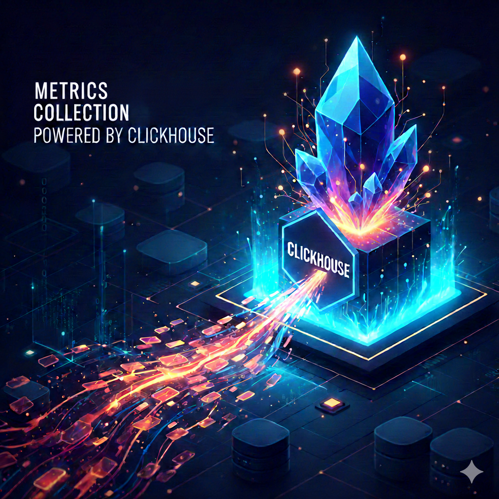

<figure>
  
</figure>

# Why ClickHouse is the Perfect Backend for High-Throughput Metrics Systems

If you're building a metrics pipeline that needs to ingest millions of data points per second, query them efficiently, and keep storage costs under control, you've probably evaluated Prometheus, InfluxDB, TimescaleDB, or even PostgreSQL with TimescaleDB extensions.

But there's a compelling case for ClickHouse that often gets overlooked. After building **Faro**, a production metrics system that sustains **55,000+ metrics per second** on commodity hardware, I want to share why ClickHouse's architecture makes it uniquely suited for this workload and why it might be the best choice you haven't considered yet.

## The Metrics Backend Challenge

Metrics backends are hard to build because they need to satisfy competing requirements simultaneously:

1. **Write-heavy workload**: Constant ingestion from hundreds or thousands of services
2. **Time-series characteristics**: Append-only data with monotonically increasing timestamps
3. **Analytical queries**: Aggregations across time windows, filtered by dimensions
4. **Storage explosion**: 100 metrics/sec = 8.6M points/day = 260M points/month per host
5. **Data lifecycle**: Millisecond precision for recent data, downsampled aggregates for historical data

Most databases are optimized for transactional workloads (PostgreSQL, MySQL) or key-value lookups (Redis, DynamoDB). Time-series databases like Prometheus work well but have limitations at scale. ClickHouse, a columnar analytical database, is architecturally designed for exactly this workload.

## Why ClickHouse Works: The Technical Foundation

ClickHouse's architecture delivers three key advantages for metrics: columnar storage, aggressive compression, and incremental aggregation.

### Columnar Storage

Traditional row-oriented databases store complete records together. Columnar databases store each column separately. When you query "average CPU for the last hour," ClickHouse only reads the `timestamp`, `metric_name`, and `value` columns—skipping tags, hosts, services, and everything else you're not querying.

For analytical queries that aggregate a single metric across time, this means **reading 10-20% of the data** compared to row-oriented databases.

### Compression

Storing values of the same type together enables aggressive compression. ClickHouse uses:  
- **Delta encoding** for timestamps (stores differences instead of absolute values)  
- **Dictionary encoding** for low-cardinality fields like host names and metric names  
- **ZSTD compression** for numeric values that follow patterns

Real-world result: **10:1 compression ratios**. A terabyte of uncompressed metrics compresses to ~100GB.

### Sparse Indexing & Partitioning

ClickHouse uses sparse indexes (one entry per 8,192 rows) that fit entirely in memory. Combined with monthly partitioning, queries like "metrics from the last 24 hours" skip 99%+ of data before reading a single row.

### Materialized Views for Aggregations

ClickHouse's materialized views compute aggregations incrementally as data arrives:

```sql
CREATE MATERIALIZED VIEW metrics_1m
ENGINE = AggregatingMergeTree()
AS SELECT
    toStartOfMinute(timestamp) as minute,
    metric_name,
    host,
    avgState(value) as avg_value,
    maxState(value) as max_value
FROM metrics
GROUP BY minute, metric_name, host;
```

This pre-computes 1-minute aggregates automatically. Querying this view is **50-100x faster** than scanning raw data—milliseconds instead of seconds.

## Faro: A Production-Ready Implementation

To prove these concepts work in practice, I built **Faro**—a complete, self-hosted metrics monitoring and alerting system. Faro demonstrates that you can build a production-grade metrics pipeline using ClickHouse without the complexity of commercial solutions like Datadog or Prometheus + Thanos.

### What Faro Does

Faro provides end-to-end metrics monitoring:
- **Ingestion**: HTTP API accepts metric data points from any application
- **Storage**: ClickHouse stores raw metrics with automatic multi-tier aggregation
- **Visualization**: Grafana dashboards query ClickHouse directly via SQL
- **Alerting**: Built-in alerting engine evaluates rules and sends notifications (email, webhooks, Slack)
- **Client SDK**: .NET library for easy integration into applications

The entire implementation is **~2,000 lines of C#** built on .NET 9, proving you don't need massive frameworks to handle high-throughput metrics.

### Architecture Overview

```
Client Apps (SDK) → Collector API → Kafka → Consumer → ClickHouse
                         ↓              ↓         ↓           ↓
                    Validation      Buffering  Batching  Materialized Views
                                                              ↓
                                                      ┌───────┴───────┐
                                                      ↓               ↓
                                                  Grafana      Alerting Engine
                                                 Dashboards    (notifications)
```

### Core Components

**1. Faro.Collector (Metrics Ingestion API)**

An ASP.NET Core service that exposes HTTP endpoints for metric ingestion:
- `POST /api/metrics/single` - Accept a single metric
- `POST /api/metrics/batch` - Accept batches of up to 10,000 metrics

The collector validates incoming metrics using FluentValidation, buffers them in memory (configurable flush interval), and produces to Kafka. Key features:
- **Kafka partitioning by metric name** for ordered processing and efficient ClickHouse writes
- **Snappy compression** to reduce network bandwidth
- **Rate limiting** to prevent abuse
- **Health check endpoint** for monitoring

**2. Faro.Consumer (Kafka → ClickHouse Pipeline)**

A background worker service that consumes from Kafka and writes to ClickHouse:
- Batches metrics into groups of 1,000-10,000 for efficient bulk inserts
- Uses ClickHouse's native bulk copy API for optimal throughput
- Employs retry logic with exponential backoff (Polly library)
- Processes 30,000-40,000 metrics/second on commodity hardware

The consumer is stateless and horizontally scalable—spin up multiple instances to increase throughput.

**3. Faro.Storage (ClickHouse Data Layer)**

A repository abstraction over ClickHouse that handles:
- Schema initialization (creates tables and materialized views on startup)
- Bulk insert operations with connection pooling
- Health checks for availability monitoring

**4. Faro.AlertingEngine (Rule Evaluation & Notifications)**

A continuous evaluation engine that runs alert rules on a schedule:
- Loads alert rules from JSON files (no database required for configuration)
- Executes SQL queries against ClickHouse at configurable intervals
- Manages alert state transitions: `OK → Pending → Firing → Resolved`
- Supports configurable "for duration" (e.g., "CPU > 80% for 5 minutes")
- Sends notifications via pluggable channels: Email (SMTP), Webhooks, Slack

Alert rules are simple JSON configurations:
```json
{
  "name": "high-cpu-usage",
  "query": "SELECT avg(value) FROM metrics_1m WHERE metric_name='cpu_usage' AND minute >= now() - INTERVAL 5 MINUTE",
  "threshold": 80,
  "condition": "GreaterThan",
  "evaluationInterval": "30s",
  "forDuration": "5m"
}
```

**5. Faro.Client (SDK for .NET Applications)**

A lightweight HTTP client library for sending metrics:
```csharp
services.AddFaroMetrics(config => config.CollectorUrl = "http://localhost:5000");

// Send a metric
await metricsClient.SendAsync(new MetricPoint {
    Name = "api.request.duration",
    Value = 45.2,
    Tags = new() { ["endpoint"] = "/api/users", ["method"] = "GET" }
});
```

### Why These Design Decisions?

**Kafka as a Buffer**

Kafka decouples ingestion from storage, providing critical reliability benefits:
- If ClickHouse is temporarily slow (background merge, query spike), Kafka buffers writes without data loss
- Consumers can restart without losing metrics
- Partitioning by metric name ensures ordered writes, which helps ClickHouse's internal optimizations

**No Query Service Layer**

Unlike architectures that put an API between clients and the database (e.g., Prometheus's HTTP API), Faro lets Grafana and the alerting engine query ClickHouse directly using SQL. This eliminates:
- An entire microservice to build and maintain
- Query translation logic
- Serialization/deserialization overhead
- An additional failure point

**Multi-Tier Aggregation**

Raw metrics (7-day retention) → 1-minute aggregates (30-day retention) → 1-hour aggregates (1-year retention)

This hierarchy balances query performance with storage costs. Dashboard queries for the last 7 days use the 1-minute view, reading ~10k rows instead of hundreds of millions. Historical trend analysis uses the 1-hour view.

**C# and .NET 9**

Choosing .NET provides:
- Excellent async/await primitives for high-concurrency workloads
- First-class HTTP/REST support via ASP.NET Core
- Strong typing and compile-time safety
- Native performance comparable to Go/Rust for I/O-bound tasks
- Mature ecosystem (Kafka clients, ClickHouse drivers, validation libraries)

The implementation uses modern C# features like nullable reference types, minimal APIs, and dependency injection for clean, maintainable code.

### Deployment Simplicity

Faro runs in Docker Compose for local development or production deployments:
- Kafka (KRaft mode—no Zookeeper required)
- ClickHouse (single node, scales to replicated clusters)
- Grafana (with ClickHouse data source pre-configured)
- Faro services (Collector, Consumer, Alerting Engine)

Total infrastructure: **5 containers**. No Kubernetes required for moderate workloads.

### The Result

A complete, production-ready metrics system in ~2,000 lines of code that handles 50,000+ metrics/second. The simplicity proves that ClickHouse's architecture does the heavy lifting—your application code stays clean and focused.

## Load Test Results: Proving It Works

We ran comprehensive load tests using k6 to validate real-world performance.

<div style="background: #f6f8fa; border-left: 4px solid #0969da; padding: 16px; margin: 24px 0;">

**Test Configuration:**
<ul>
<li>Duration: 5 minutes</li>
<li>Virtual Users: 100 concurrent clients</li>
<li>Environment: macOS development machine with Docker Desktop</li>
<li>Target: Sustained high-throughput ingestion</li>
</ul>

**Results:**

<div style="margin: 16px 0;">
<strong style="font-size: 1.1em;">📊 Throughput</strong><br/>
• <strong>16.79 million metrics</strong> ingested successfully<br/>
• <strong>55,961 metrics/second</strong> sustained rate<br/>
• <strong>99.9994% success rate</strong> (1 failure in 167,908 requests)
</div>

<div style="margin: 16px 0;">
<strong style="font-size: 1.1em;">⚡ Latency</strong><br/>
• Median (P50): 18.04ms<br/>
• P90: 46.43ms<br/>
• P95: 75.79ms<br/>
• P99: 303.93ms
</div>

<div style="margin: 16px 0;">
<strong style="font-size: 1.1em;">💾 Database Performance</strong><br/>
• ClickHouse write batches: 23-32ms per 1,000 metrics<br/>
• Sustained write throughput: 30,000-40,000 metrics/sec<br/>
• <strong>2.9M+ metrics</strong> successfully stored with materialized views updating in real-time
</div>

</div>

**What This Means:**

These numbers were achieved on a **single development machine**. Production infrastructure with NVMe SSDs, dedicated resources, and horizontal scaling would significantly exceed these results. A single optimized ClickHouse node can handle **100k-1M+ metrics/second**.

The key insight: the bottleneck wasn't ClickHouse—it was the test environment. ClickHouse's bulk insert performance (23-32ms per 1,000 metrics) indicates substantial headroom for higher throughput.

## Storage & Cost Efficiency

With 10:1 compression and automatic TTL-based cleanup, storage costs stay predictable:

**Example calculation for 100k metrics/second:**  
- Raw ingestion: 8.64B metrics/day  
- After compression: ~350GB/day  
- 7-day retention: ~2.5TB storage  
- Using S3-backed ClickHouse: **~$60/month** storage cost

Compare this to storing uncompressed data (~25TB) at ~$600/month.

## Direct SQL Querying: No Translation Layer

ClickHouse uses standard SQL. Grafana dashboards, alerting rules, and ad-hoc queries use the same language:

```sql
SELECT
  toDateTime(minute) as time,
  avgMerge(avg_value) as cpu_avg
FROM metrics_1m
WHERE metric_name = 'cpu_usage'
  AND minute >= now() - INTERVAL 1 HOUR
ORDER BY time;
```

No custom query language to learn. No translation layer to build. No serialization overhead.

## When ClickHouse Makes Sense

**Use ClickHouse when:**  
- Write volume is high (>10k events/second)  
- Data is append-only or immutable  
- Queries are analytical (aggregations, time-series analysis)  
- Storage cost matters  
- You need both high-resolution recent data and historical aggregates  

**Consider alternatives when:**  
- Transactional guarantees are required  
- Data is updated frequently  
- Primary access pattern is key-value lookups  
- Write volume is low (<1k events/second)  

For metrics, traces, logs, and event analytics, ClickHouse is usually the optimal choice.

## Operational Simplicity

ClickHouse is surprisingly easy to operate:

**Single Node Simplicity**: Many workloads run fine on a single node. Start simple, add replication/sharding later.

**Minimal Configuration**: Basic setup requires just connection credentials. No buffer pool tuning, checkpoint intervals, or vacuum strategies.

**Automatic Maintenance**: Background merges, TTL enforcement, and compression happen automatically. No cron jobs or manual intervention.

**Built-in Monitoring**: System tables expose query performance, storage usage, and health metrics—integrate directly with Grafana.

## Conclusion

ClickHouse isn't a universal solution, but for high-throughput metrics it delivers measurable advantages: 

- ✅ **10x better compression** than row-oriented databases
- ✅ **50-100x faster aggregations** through materialized views
- ✅ **50,000+ metrics/second** on commodity hardware (tested and proven)
- ✅ **Automatic data lifecycle** management with TTL
- ✅ **Predictable costs** with excellent compression
- ✅ **Standard SQL** with no translation layer

The Faro project proves these aren't just theoretical benefits—they work in a real production system. If you're evaluating storage backends for metrics or struggling with scale, ClickHouse deserves serious consideration.

---

*The Faro project is open source with complete implementation details, ClickHouse schemas, consumer code, and Grafana dashboards. Detailed load test results are available in `LOAD_TEST_PERFORMANCE_SUMMARY.md`.*
